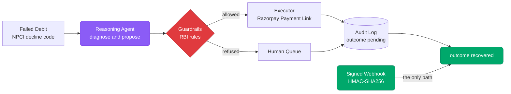
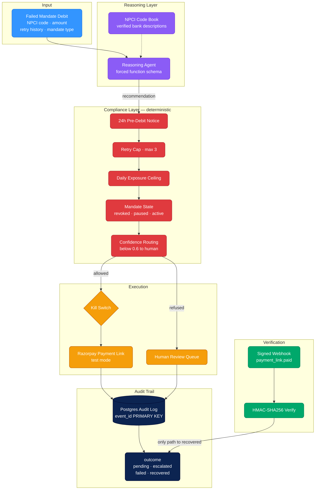

<div align="center">

# UPI Autopay Mandate Recovery Agent

### Razorpay AI Buildathon · Track 3 — AI Revenue Recovery

**Explainable Recovery · RBI-Bounded Guardrails · Webhook-Verified Audit Trail**

[](https://razorpay.com/buildathon)
[](https://python.org)
[](https://fastapi.tiangolo.com)
[](https://razorpay.com)
[](https://groq.com)
[](https://postgresql.org)
[](#testing)
[](https://mandate-recovery-agent.onrender.com)

**An agent that recovers failed UPI Autopay debits — and refuses to count a single rupee until a signed webhook proves the money actually arrived.**

[Live Demo](https://mandate-recovery-agent.onrender.com) · [Architecture](#architecture) · [Metrics](#honest-metrics) · [Build Challenges](#engineering-problems-faced-and-how-they-were-solved) · [Quick Start](#quick-start)

</div>

---

## The Problem

Card-mandate recovery is a mature product category. UPI Autopay is not the same problem, and treating it as one is where recovery systems quietly leak money:

1. **The rail fails differently.** A card mandate is a stored credential. UPI Autopay needs a live bank approval on *every single debit*, so first-attempt success runs far below card mandates — and a blind retry loop treats that structural difference as noise.
2. **The failure codes have no card equivalent.** `IE` (funds blocked against another mandate), `VA` (mandate revoked), `QA` (paused by the customer), `MA0` (mandate not present). A generic "payment failed, retry it" abstraction cannot reason about any of them.
3. **Compliance constrains the fix itself.** A 24-hour pre-debit notice, revocable vs non-revocable mandate state, and retry caps are legal boundaries, not retry heuristics. For several failure codes, retrying isn't merely useless — **it isn't permitted.**

On top of that, most recovery demos mark a case "recovered" the moment an API call succeeds, which is a self-reported number with nothing behind it.

---

## The Approach

This system is built around three ideas:

1. **Diagnose from the raw code, not a pre-labelled cause.** The reasoning agent receives the real NPCI decline code, amount, retry history, mandate type and timing — never a cause label — and must infer the failure and propose one bounded intervention through a forced function schema, so malformed or prose output is impossible by construction.
2. **Never let the model authorise its own action.** A deterministic compliance layer reviews every recommendation against RBI rules. It reads **authoritative mandate status**, not the agent's diagnosis, so it blocks an unlawful retry even when the model is confidently wrong — and it never consults the confidence score.
3. **Only cryptographic proof moves the money figure.** A case reaches `outcome: recovered` through exactly one path: a signature-verified `payment_link.paid` webhook. Not an API poll, not the executor's own success. The figure under-reports rather than overstates.



---

## Key Features

- **Rail-Specific Diagnosis** — reasons over verified NPCI/UPI decline codes, including mandate-state codes with no card equivalent.
- **Deterministic Compliance Layer** — RBI notice windows, retry caps, per-customer exposure ceilings and mandate state, as plain tested Python that overrides the model.
- **Forced Tool Calling** — every provider declares the decision schema and forces it, so a malformed response cannot reach the pipeline.
- **Provider-Agnostic** — Groq, Gemini, Claude and an offline fixture behind one interface; the guardrails catch unsafe recommendations from all of them.
- **Webhook-Verified Recovery** — HMAC-SHA256 verification is the sole route to `recovered`, with idempotent handling of duplicate deliveries.
- **Durable Audit Trail** — Postgres-backed, one immutable row per decision, with `event_id` as a `PRIMARY KEY` so a duplicate cannot double-count.
- **Human Escalation Routing** — low-confidence and undecidable cases route to review rather than acting.
- **Kill Switch** — one environment variable halts every external side effect.
- **Live Audit Console** — a deployed UI showing every decision, the verdict that reviewed it, and the outcome.

---

## Architecture



**Two properties carry the whole design:**

| Property | Why it matters |
|----------|----------------|
| **The guardrail is independent of the model** | It reads authoritative `mandate_status`, not the agent's diagnosis — so it blocks an unlawful retry even when the model misdiagnoses the failure completely, and however confident it claims to be. The agent never sees `mandate_status` or the ground-truth label. |
| **Only a signed webhook can say `recovered`** | Not an API poll, not the executor's own success. The rupee figure moves on cryptographic evidence alone, and under-reports when that evidence is missing. |

---

## Key Technical Decisions

| Decision | Why |
|----------|-----|
| **Guardrails read mandate state, not the model's diagnosis** | A confident misdiagnosis must not be able to authorise an unlawful debit. Independence is the entire safety property — it has a dedicated test asserting the block holds when the diagnosis is wrong |
| **The decision schema is *forced*, not requested** | Every provider uses native forced tool calling, so "please return JSON" drift is impossible by construction rather than merely unlikely |
| **The model gets the NPCI code book, but never the cause labels** | Withholding a bank's own reference table measures recall of an obscure lookup, not reasoning. Supplying the answers would make `likely_cause` a restatement of an input — tests fail if a description ever leaks a cause label |
| **`recovered` is set only by a verified webhook** | An API poll or a successful executor call is a self-reported number. Under-reporting is preferable to overstating recovered revenue |
| **`event_id` is a Postgres `PRIMARY KEY`** | Razorpay's docs warn duplicate deliveries happen. `ON CONFLICT DO NOTHING` makes double-counting structurally impossible, not merely handled |
| **Confidence is a one-way escalation trigger, never permission** | Measured across three runs, self-reported confidence did not separate correct answers from incorrect ones — so it routes to human review and nothing else |
| **`reference_id` is per-attempt, not per-mandate** | Razorpay requires uniqueness, and a retry sequencer makes multiple attempts per mandate by design. The mandate is resolved back from the link's notes |
| **The test suite is blocked from live APIs** | A session-wide fixture strips credentials plus a regression test that fails if a live client is ever constructed — without it, `load_dotenv()` at import made every test run hit production |

---

## Honest Metrics

`run_batch.py` reports diagnosis accuracy per cause, hard cases explicitly (never averaged away), guardrail overrides, escalation count, ₹ at risk vs recovered, and **false-positive cost** — cases where the model was confident and wrong.

### Measured run — 60 cases, Groq `openai/gpt-oss-120b`

| Metric | Value |
|--------|-------|
| Cause diagnosis accuracy | **93–97%** across three runs |
| Guardrail overrides | **4–5** per run, across 3 distinct rules |
| Escalated to human review | **3–4** |
| ₹ at risk across the batch | **₹274,640** |
| False-positive cost | **₹13,000** or below (2–4 confident-but-wrong cases) |

Figures are ranges because the model is not deterministic and each run differs. A single run's numbers are quoted only where the point depends on that run. Errors concentrate on the genuinely ambiguous codes — `B3` ("transaction not permitted to the account") and `QA` (mandate paused by user) — not on the common failure modes, which score 100%.

### The finding that matters

Accuracy is the least interesting number here. This is the important one, measured across three independent 60-case runs:

| Run | Accuracy | Confidence when **right** | when **wrong** | Gap |
|-----|----------|---------------------------|----------------|-----|
| A | 93% | 0.898 | 0.895 | +0.003 |
| B | 97% | 0.889 | **0.940** | **−0.051** |
| C | 95% | 0.894 | 0.880 | +0.014 |

In run A the two were indistinguishable. In run B the model was **more confident about its mistakes than its correct answers**. In run C the gap reappeared, tiny, in the other direction.

The gap is noisy by construction — with only 2–4 wrong cases per run, it would be dishonest to quote any single figure as a stable measurement, and the sign flips between runs. **That instability *is* the result.** What survives all three is the robust claim: self-reported confidence does not reliably separate correct answers from incorrect ones. It never behaved like a probability in any run, in either direction.

That is the entire justification for this architecture:

- Confidence is used **only** as a one-way escalation trigger, never as permission to act.
- The compliance rules are deterministic code that override the model regardless of how certain it claims to be.
- The guardrail reads authoritative mandate state, so a confident misdiagnosis still cannot produce an illegal retry.

The threshold does earn its place occasionally: `ZA` ("transaction declined", no reason given) came back at **0.30** and was routed to a human. That is the signal working as intended — but on a handful of cases in 60, it is a backstop, not a control.

### What the guardrails actually caught

Three distinct rules fired on real cases, none of them contrived:

```
UT    daily_exposure_cap_exceeded: retrying ₹9,999 would take this customer's
      same-day retry exposure above the ₹5,000 cap
U67   retry_cap_exceeded: 3 attempts already made, max is 3
ZA    low_confidence_escalation: AI confidence 0.30 is below the 0.60 threshold
```

> **Reported honestly:** the mandate-state rule did *not* fire in this run — the model never recommended retrying a revoked mandate, so the block had nothing to catch. That case is covered by an explicit test rather than left to chance, including one asserting the block still holds when the model misdiagnoses the cause entirely.

### The number that only moves on proof

This happened in two acts, and the first one matters as much as the second.

**Act one — the refusal.** A test-mode Payment Link for ₹9,999 was created by the executor and genuinely paid. Razorpay confirmed `status=paid`. The audit log still read **`pending`**, because no signature-verified event had arrived. The money was real and the agent still refused to count it.

**Act two — the proof.** Once deployed to a public endpoint, Razorpay's servers delivered a real signed webhook, the app verified the HMAC, resolved the per-attempt reference back to its mandate, and flipped the outcome:

```
Razorpay      payment link   status = paid        (webhook signed and delivered)
Audit log     MID6EA8B317FA  outcome = recovered  INR 2,999
```

Nothing in that chain was simulated: real model reasoning, a real Payment Link created by the deployed service, a real payment, and a webhook signed by Razorpay and verified on arrival. Same system, same real money — `pending` without proof, `recovered` with it.

**A third act, briefly.** The first verified recovery was ₹9,999, and a redeploy destroyed it — see problem 11 below. That is what forced the audit log onto Postgres.

---

## Engineering Problems Faced, and How They Were Solved

Every one of these was found by testing against the real thing rather than by reading code. Several would have failed live on camera.

### 1. The decline codes were fabricated

The first dataset used codes like `RC01`, `RC51`, `MD21` — plausible-looking, but **not real UPI codes**. They were card-style ISO 8583 codes with invented prefixes, which any payments engineer would spot instantly.

> **Fixed by** verifying every code against Axis Bank's published *UPI Response Codes for H2H/API* list and replacing the full mapping: `Z9`, `IE`, `U67`, `UT`, `XY`, `IR`, `U28`, `Z8`, `Z7`, `ZU`, `M2`, `VA`, `QA`, `MA0`, `ZM`, `Z6`, `AM`, `ZA`, `U30`, `B3`. The `unknown` bucket now holds genuinely ambiguous codes (`ZA`, `U30` — declines the bank returns with no stated reason), so those cases cannot be solved by any lookup table.

### 2. The guardrail was reading the answer key

The mandate-state check tested `true_cause` — a ground-truth label that exists only for scoring. Functionally correct, but indefensible: a reviewer would call it cheating.

> **Fixed by** adding a `mandate_status` field representing what an authoritative bank/NPCI mandate lookup returns. The guardrail reads that; the model never sees it. This is strictly stronger — the guardrail now blocks unsafe retries *even when the model's diagnosis is wrong*, which is covered by its own test.

### 3. The audit log discarded what actually happened

The executor's response — including the Payment Link id and URL — was computed and thrown away. The trail stopped at "we decided to notify," with no way to tie a decision to the link it produced. A hole in the project's headline feature.

> **Fixed by** recording an `execution_result` on every audit row, filtered to audit-relevant fields so customer contact details from the provider response never enter the log.

### 4. The demo worked exactly once

Razorpay requires `reference_id` to be unique. It was set to the mandate id, so the **second** run of any mandate failed with *"payment link with given reference_id already exists."* Conceptually wrong too — a retry sequencer makes multiple attempts per mandate by design.

> **Fixed by** making the reference per-attempt (`MID…-a2-0d95f7e4`) and resolving the mandate back from `notes.mandate_id`, with the reference prefix as fallback. Verified by running identical mandates twice against the live API.

### 5. The test suite was calling the live API

`load_dotenv()` runs at import, so once real credentials were in `.env`, **every `pytest` run created real Payment Links** on the account and burned the API rate limit. Test-fixture mandate ids were visible in the live dashboard.

> **Fixed by** a session-wide `conftest.py` fixture that strips credentials, plus a regression test that fails loudly if anything tries to build a live client. Suite runtime dropped from 3.2s to 0.94s — confirmation the calls were real.

### 6. Rate limits were silently dropping cases

Razorpay returns throttling as an ordinary `BadRequestError`, and the SDK's built-in retry only covers `ConnectionError` — so a 40-link batch lost cases with no error surfaced. The same applied to the free-tier LLM (HTTP 429) and to network timeouts on a consumer connection.

> **Fixed by** exponential backoff on both clients, distinguishing retryable throttling from genuine bad requests (which must fail fast), and a `--resume` flag so a quota-interrupted batch continues instead of re-spending on decided cases.

### 7. Tunnelling services were blocked by the network

Webhook testing needs a public URL for localhost. Both ngrok and Cloudflare Tunnel were unreachable — connection reset at the ISP, while GitHub and PyPI resolved normally.

> **Fixed by** diagnosing per-host reachability rather than assuming general network failure, and switching to an SSH reverse tunnel, then to a deployed public endpoint.

### 8. The "reproducible" dataset wasn't reproducible

The generator takes a `--seed`, and the distribution was stable — but `mandate_id` came from `uuid4()`, which ignores the seed entirely. The same seed produced different mandate ids on every run. This defeated the whole point of shipping a generator instead of a CSV, and silently broke `--resume` and audit correlation.

> **Fixed by** drawing the id from the seeded RNG, and making the clock injectable so a given seed plus a given `now` yields a byte-identical batch. Two tests pin this: full determinism under a fixed clock, and id stability regardless of wall-clock time.

### 9. The model was hallucinating the code book

With only the raw code as input, diagnosis accuracy was **42%**, and the failures were concentrated entirely on codes the model had never learned: `IE` was read as "Invalid Entity" (it means funds blocked against another mandate), `IR` as a mandate problem. Worse, it was *confident* while wrong — mean confidence 0.92, and not one case fell below the 0.6 escalation threshold, so the human-review path never fired.

The instinct is to call this an honest measure of model limits. It isn't: no production recovery system withholds its own reference table, so this was measuring recall of an obscure lookup rather than reasoning.

> **Fixed by** supplying the verified NPCI code reference in the system prompt — the banks' own descriptions, deliberately **not** the cause labels. Mapping a description onto one of six causes, and then choosing a bounded intervention from retry history, amount, notice window and mandate type, remains the model's judgement. `tests/test_npci_codes.py` pins that line: it fails if any description ever contains a cause label, and if the ambiguous codes (`ZA`, `U30`) ever gain a diagnostic description.

Accuracy across the full 60-case batch went from **42% to 93%+**, and the escalation route began firing on genuinely unresolvable codes instead of never firing at all. What the code book did *not* fix is calibration: the model remained equally confident when wrong as when right. Better inputs bought accuracy, not self-knowledge — which is why the guardrails stayed deterministic rather than being relaxed once the numbers improved.

### 10. One malformed response killed a 60-case run

Thirty-six cases into a full batch, the provider returned `HTTP 400 tool_use_failed`. The model had generated `"confidence": 0. nine` — a number written as words, which is not valid JSON.

Two things are worth separating. The **schema guarantee worked**: the malformed arguments were rejected at the provider and never reached the pipeline. The **handling was wrong**: the exception propagated all the way up and destroyed the run, losing the remaining 24 cases. A recovery system that dies because one model response came back garbled is not production-ready.

> **Fixed on two levels.** `tool_use_failed` is now retried, since it is a sampling glitch rather than a bad request. More importantly, a case the model cannot decide — for any reason, including provider outages and timeouts — becomes a **zero-confidence decision routed to human review** and recorded in the audit log, instead of an exception. The batch continues; the failure itself is auditable.

### 11. The "immutable" audit log was not durable

The audit log was an append-only JSONL file. Append-only is not the same as durable, and the difference showed up the hard way: a redeploy rebuilt the container, the filesystem was ephemeral, and **the webhook-verified ₹9,999 recovery vanished**. The evidence for the project's central claim was destroyed by a routine deployment.

Calling a file "immutable" was describing the write pattern and quietly implying a persistence guarantee it never had.

> **Fixed by** adding a Postgres backend behind the same three-function interface (`append_entry` / `load_log` / `mark_recovered`), selected by `DATABASE_URL`, with the JSONL file kept as the zero-setup path for local development and tests. `render.yaml` now provisions the database and wires the connection string in.

This also closed a requirement the file backend could never satisfy. The brief asks for a unique constraint on `event_id` so a duplicate delivery cannot double-count a recovery; a file cannot enforce that, so idempotency was previously a convention held up by application code. It is now `event_id TEXT PRIMARY KEY` with `ON CONFLICT DO NOTHING` — enforced by the database whatever the application does.

### 12. Python 3.8 blocked the official SDK

The free-tier provider's SDK requires Python 3.9+, and `pip` downloads were timing out.

> **Fixed by** calling the REST API directly with `httpx` — already a dependency. This also gave direct control over `tool_config: {mode: "ANY"}`, which *forces* the function call, preserving the guarantee that a malformed or prose response is impossible by construction.

### 13. The free-tier cold start dropped a webhook

A webhook delivery failed once in testing for an unglamorous reason: the free instance spins down when idle, and Razorpay's delivery timed out against a cold container.

> Worth stating rather than hiding, because the system's response to it was correct — the case stayed `pending`. It did not guess, and it did not fall back to trusting the API. Razorpay retries, and a warm instance takes the delivery. In production this runs warm, with those retries as the backstop.

---

## Project Structure

```text
├── agent/
│   ├── schemas.py           # pydantic — validation, storage and export share one definition
│   ├── reasoning_agent.py   # provider switch + Claude forced tool-calling
│   ├── groq_agent.py        # free-tier provider over REST, forced tool calling
│   ├── gemini_agent.py      # free-tier provider over REST
│   ├── stub_agent.py        # deterministic offline fixture (tagged, never valid for metrics)
│   ├── npci_codes.py        # verified NPCI/UPI code reference given to the model
│   ├── guardrails.py        # deterministic RBI rule functions
│   ├── executor.py          # Razorpay Payment Links + kill switch + rate-limit backoff
│   ├── webhook_handler.py   # HMAC-SHA256 verification, flips outcome → recovered
│   ├── audit_log.py         # backend dispatch — Postgres or JSONL
│   ├── pg_store.py          # Postgres backend, event_id PRIMARY KEY
│   ├── pipeline.py          # wires the core loop
│   ├── report.py            # metrics, per-cause and hard-case breakdowns
│   └── dashboard_data.py    # powers the audit console
├── data/
│   └── generate_dataset.py  # reproducible synthetic batch, seeded
├── static/
│   ├── index.html           # landing site
│   ├── pitch.html           # self-playing pitch presentation
│   └── console.html         # audit console
├── scripts/
│   └── cancel_test_links.py # clears test-mode links between demo runs
├── tests/                   # 98 tests, incl. a guard that the suite never hits a live API
├── run_batch.py             # demo entry point
├── app.py                   # FastAPI — webhook receiver + console + demo endpoints
└── render.yaml              # deployment blueprint + Postgres database
```

Synthetic input data is generated, never hand-typed, so the distribution is reproducible and provably not cherry-picked:

```powershell
python data/generate_dataset.py --count 60 --seed 42
```

---

## Tech Stack

| Layer | Technology |
|-------|-----------|
| API | FastAPI + Uvicorn |
| Reasoning | Groq (`openai/gpt-oss-120b`) · Gemini · Claude · offline fixture |
| Schema Enforcement | Native forced tool calling per provider + pydantic validation |
| Payments | Razorpay Python SDK — test mode Payment Links |
| Verification | HMAC-SHA256 webhook signature |
| Audit Store | PostgreSQL (`event_id` PRIMARY KEY) with JSONL fallback |
| Metrics | pandas |
| Testing | pytest — 98 tests |
| Deployment | Render blueprint (`render.yaml`) |

---

## Quick Start

### 1 — Install

```powershell
git clone https://github.com/Saniya6112003/mandate-recovery-agent.git
cd mandate-recovery-agent
python -m venv .venv
.\.venv\Scripts\activate
pip install -r requirements.txt
```

### 2 — Configure environment

Copy `.env.example` to `.env`. It defaults to the **offline provider**, so the whole pipeline runs with no API key and no spend.

```env
# Which reasoning backend to use: groq | gemini | anthropic | stub
REASONING_PROVIDER = "stub"

# Groq — free tier, generous limits
GROQ_API_KEY = ""
GROQ_MODEL = "openai/gpt-oss-120b"

# Google AI Studio — free tier, 20 requests/model/day
GEMINI_API_KEY = ""
GEMINI_MODEL = "gemini-3.6-flash"

# Anthropic — paid, ~$0.14 per 60-case batch
ANTHROPIC_API_KEY = ""
ANTHROPIC_MODEL = "claude-sonnet-5"

# Razorpay TEST mode — free, no KYC, no real money can move
RAZORPAY_KEY_ID = ""
RAZORPAY_KEY_SECRET = ""
RAZORPAY_WEBHOOK_SECRET = ""        # must match the secret set on the dashboard webhook

# Durable audit log. Omit to fall back to a local JSONL file.
DATABASE_URL = ""

# Halts every external side effect
RECOVERY_KILL_SWITCH = "false"
```

> Stub output is tagged `[OFFLINE STUB]` in every audit row and the report prints a warning — fixture numbers can never be mistaken for real metrics.

### 3 — Generate the batch

```powershell
python data/generate_dataset.py --count 60 --seed 42
```

### 4 — Run the recovery loop

```powershell
python run_batch.py                 # full batch + metrics report
python run_batch.py --limit 10      # small run
python run_batch.py --resume        # continue after a quota/rate-limit interruption
```

### 5 — Launch the app

```powershell
uvicorn app:app --reload --port 8000
```

| Endpoint | Purpose |
|----------|---------|
| `/` | Landing site — problem, pipeline, guardrail moment, build challenges |
| `/pitch` | Self-playing pitch presentation |
| `/console` | Audit console — every decision, verdict and outcome |
| `/api/dashboard` | Metrics and decision rows as JSON |
| `/webhook` | Razorpay receiver, HMAC-SHA256 verified |
| `/demo/run-batch?limit=N&resume=true` | Run a live batch |
| `/healthz` | Health check — reports active provider, audit backend and kill-switch state |

### 6 — Run the tests

```powershell
python -m pytest
```

Covers the guardrail rules including the revoked-mandate override, exposure caps enforced across a batch, webhook signature rejection and idempotent duplicate delivery, rate-limit backoff, provider routing, dataset reproducibility, and a guard proving the suite never reaches a live API.

---

## Deployment

`render.yaml` provisions the service and its Postgres database as a Render blueprint: connect the repo, supply four secrets (`GROQ_API_KEY`, `RAZORPAY_KEY_ID`, `RAZORPAY_KEY_SECRET`, `RAZORPAY_WEBHOOK_SECRET`), deploy. Secrets are marked `sync: false` so they never enter git, and a pre-commit hook blocks any commit containing a key.

Deployment is a correctness requirement here, not a convenience: a signature-verified webhook needs an endpoint Razorpay can actually reach. Point the Razorpay webhook at `https://<service>/webhook` with `payment_link.paid` enabled.

> The free instance sleeps when idle and takes ~30s to wake. Razorpay retries failed deliveries, so a sleeping instance delays a confirmation rather than losing it — but hit the URL once before a live demo so the first request isn't the cold start.

---

## Production Readiness

| Layer | Status |
|-------|--------|
| Core recovery loop | Built |
| Compliance guardrails | Built — deterministic, tested |
| Audit log | Built — durable (Postgres), idempotent, exportable |
| Human escalation routing | Built — confidence threshold |
| Kill switch | Built |
| Audit console | Built — deployed |
| Webhook-verified recovery | Built — confirmed against live Razorpay |
| Full RBI rule coverage beyond demo cases | Designed |
| Reviewer workflow UI, drift detection | Designed |

---

<div align="center">

**Synthetic mandate failures with real NPCI decline codes. Razorpay runs in test mode — real API, real signed webhooks, no real money.**

[Live Demo](https://mandate-recovery-agent.onrender.com) · [Audit Console](https://mandate-recovery-agent.onrender.com/console)

</div>
